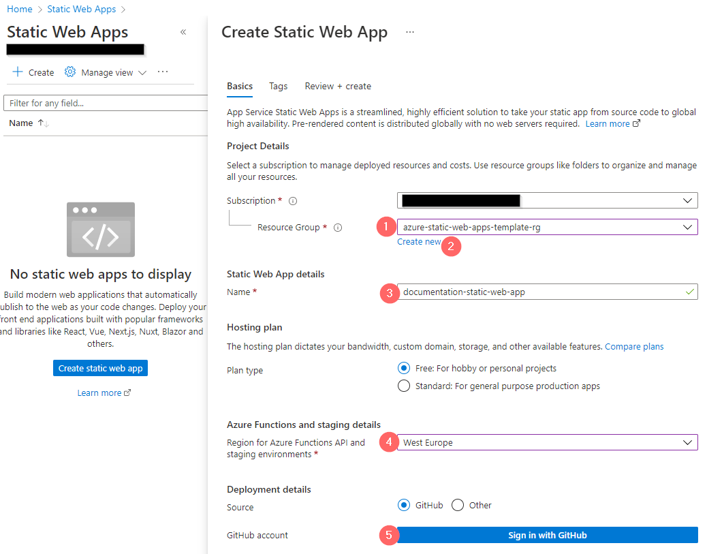
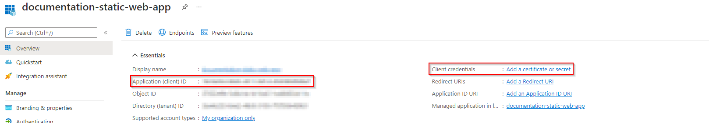
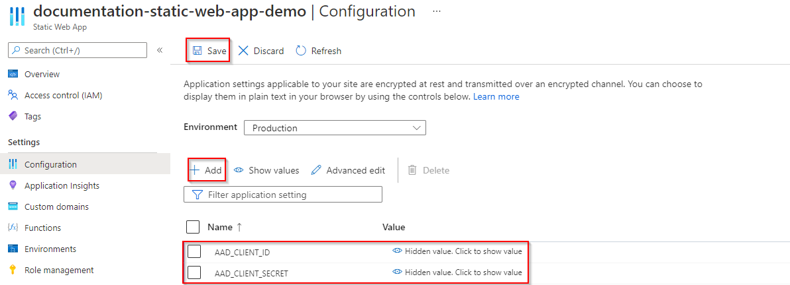
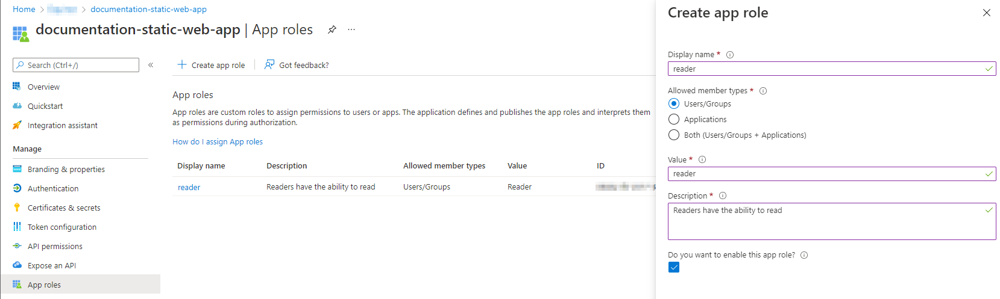

# Documentation with access control using Azure Static Web Apps \[template\]
This repository contains an example of how you can use Azure Static Web Apps to host public and private documentation for you projects. It contains examples of how to host Sphinx/MkDocs documentation and limit the access to certain roles. This repository should work with any type of documentation generator that can compile to HTML files and is not limited to the examples you find in the repo.

Check out the live demo [here](https://red-field-01d6e5103.1.azurestaticapps.net)

## Getting started
This guide uses poetry to manage dependencies and virtual environments, but any package manager should work with some configuration. Please note that you will need the following to complete this setup:
1. A GitHub-account
2. An Azure account and subscription

### Prepare the repo
Fork this repository or click the template button above.

### Set up the Azure Static Web App
1. In [Azure Portal](http://www.portal.azure.com), navigate to [Azure Static Web App in Azure](https://docs.microsoft.com/en-us/azure/static-web-apps/get-started-portal?tabs=vanilla-javascript) and create a new resource. Go through the setup wizard and connect it to your forked repository
2. Create Static Web App (image below):
    1. Select a resource group. If you haven't already created a Resource Group, see the point below
    2. (Optional) To create a new resource group, click the "Create new"-button underneath the drop-down for selecting resource groups. Alternativly, from the [Azure Portal](http://www.portal.azure.com), go to "Resource Group" and click "Create". Go through the setup wizard to create you resource group.
    3. Give your Static Web App Resource a descriptive name
    4. Select a desired region for hosting your resource. For Equinor employees, we normally select the region that is closest to Norway.
    5. Press the button "Sign in with GitHub" and follow the instructions in the pop-up window.

<p align="center" style="border:2px; border-style:solid; padding:1em">
  
</p>

3. Connect to GitHub (image below):
    1. After completing the GitHub login, use the "organization", "repository" and "branch" drop-down menus to select the repository you forked. In this walkthrough, we connect the wep app to the `main`-branch. If you want to keep a separate branch for built documentation, feel free to do so.
    2. Select "Custom" in the "Build Presets"-dropdown
    3. Enter `/api`in the "Api location field, and `/docs/build` in the "Output location" field

<p align="center" style="border:2px; border-style:solid; padding:1em">
  
</p>

4. Finish the setup wizard by clicking the "review + create"-button and then the "Create"-button.

### <a name="under-the-hood"></a>Under-the-hood: What happens now? (optional to read)

1. Your newly created Static Web App has a deployment token which you can view here:
2. First, Azure automatically registrers this token as a secret in your repository, which you can view by visiting your GitHub Repo > Settings > Secrets > Actions. This gives the Web App access to your repo

<p align="center" style="border:2px; border-style:solid; padding:1em">
  
</p>

3. Second, Azure creates a pull request to your repo which contains a new GitHub Action. This is triggered automatically when anything is pushed to main, and will handle the connection and deployment of content to yout Static Web App. You can view triggered actions by clicking on "Actions" in your GitHub repo. You can view the newly created GitHub Action file in the foled `.\.github\workflows`.
4. After the GitHub Action has completed, you can visit the URL found on the resource page of your Azure Static Web App. If deployed successfully, you should be welcomed by the following demo page:

<p align="center" style="border:2px; border-style:solid; padding:1em">
  
</p>


### Automate the compilation of docs
Azure Static Web Apps does not support building non-Javascript projects and therefore you have to compile the docs before it gets deployed. Thankfully, [Github Actions](https://github.com/features/actions) allows us to build and compile the HTML files as part of the action that deploys them to the web app. Doing it this way allows us to delete the build files, so that we do not have to have them committed into our repository. Furthermore, it ensures that we do not have to run any manual steps to update the documentation. Neat! This also means that we can use almost any type of documentation compiler as long as it is possible to install on the Github Action build server and it can compile to HTML. Nice! For this repository, `sphinx` and `mkdocs` is used, but it can modified to work with your preferred build tool.

To build the docs using `sphinx` and `mkdocs`, we need to add some custom build steps to the workflow file that the Static Web App created during its setup.

1. Clone the repository to your local machine
2. Locate the workflow file located in `.\.github\workflow`. It typically shares name with the Static Web App and its URL.
3. Delete the script `.\github\workflows\deploy-site.yml` (you can also delete the `lint-and-format.yml`-sctipt if you don't want it)
4. Below the following step in the the workflow file...
```yaml
- uses: actions/checkout@v2
        with:
          submodules: true
```
Insert the following steps (between line 20 and 21):
```yaml
- name: Set up Python 3.8
  uses: actions/setup-python@v2
  with:
        python-version: 3.8

- name: Run image
  uses: abatilo/actions-poetry@v2.0.0
  with:
        poetry-version: 1.1.13

- name: Install Poetry
  run: poetry install
    
- name: Build docs with Sphinx
  run: poetry run sphinx-build -b html docs/source/sphinx-example docs/build/sphinx-example

- name: Build docs with MkDocs
  run: poetry run mkdocs build --config-file docs/mkdocs.yml
```
5. (Optional) Consider renaming the workflow-file to something more descriptive, like `deploy-site.yml`. This will show up above your workflow when clicking on a GitHub Workflow run.
6. (Optional) Consider giving the workflow a more descriptive name. This is done by changing the `name`-value in the yml-file. This name shows up in your GitHub Actions, so giving it a descriptive name makes it easier for you to find it there.
7. (Optional). The workflow-file uses the GitHub-secret twice for its `azure_static_web_apps_api_token`-parameter (it is named something like `secrets.XXX`). If you want to rename this to something more descriptive (like e.g. `secrets.DEPLOYMENT_TOKEN`), copy the deployment token and create a new GitHub Action Secret with the desired name. Use this name in your yml-file. See the [under-the-hood](#under-the-hood)-section for information on how to locate the deployment token and GitHub Secret. You can then delete the old GitHub Action Secret.
8. Commit and push your changes, and verify that you action finishes successfully.


## Modifying the documentation
**Sphinx:**<br>
Sphinx expects `.rts`-files as default, but can be extended to support a range of different file formats (like e.g. markdown). Locate the example in the `.\docs\sources\sphinx-example`-folder. To add a new pages, create the file and add it to the `index.rst`-file. Then re-build the documantation page by either pushing a new commit or by building it manually (see the next chapter).

**MkDocs**<br>
MkDocs only supports markdown-files. An example is located in the `.\docs\sources\equinor-example`-folder. To add a new pages, create the file and add it to the `mkdocs.yml`-file. Then re-build the documantation page by either pushing a new commit or by building it manually (see the next chapter).<br>
**NB!** The `mkdocs.yml` file would normally be placed at the top folder for the documentation files, but is currently placed on level above in this demo to make it easiere to work with two documentation frameworks.

## Building the documentation manually
1. [Install poetry](https://python-poetry.org/docs/) and then run `poetry install` in the project folder OR use any package manager of your choice and ensure that you have `sphinx` and/or `mkdocs` installed.<br>
**NB!** If you experience trouble installing poetry (especially if you're an Equinor employee on a Windows), try the following:

    1. Don't install Python using the Windows Store. Instead, download and install [Python 3.8](https://www.python.org/downloads/release/python-380/) (others have ewxperienced issues with the MS Store verison, see [here](https://github.com/python-poetry/poetry/issues/1895) and [here](https://github.com/python-poetry/poetry/issues/1587))

    2. As an Equinor employee, following the [documentation](https://python-poetry.org/docs/) might result in a socket-error: "socket.gaierror: [Errno 11001] getaddrinfo failed". This is probably a proxy-issue that occurs when you are on the work-network. Try repeating the installation step from a different network (e.g. hotspoting from your phone), or modify the relevant proxies.

    3. Despite the Poetry documentation explicitly stating that it add the relevant PATH environment variables for you, this does not happen in all cases. If this becomes an issue, try manually adding `%USERPROFILE%\.poetry\bin`. When this is done, verify that it works by running `poetry --version` in your terminal

    4. By default, Poetry creates a virtual environment in `{cache-dir}\virtualenvs` (Windows). If you instead want it to be placed in the same folder as your project, enter the following command in you terminal `poetry config virtualenvs.in-project true`. If you now run `poetry install`, the relevant files should now be placed in your current working directory-

2. Depending on which documentation compiler you are using, choose either 1, 2 or both. Make a change in the docs and see that is included in your build
    - Sphinx:
        1. Recompile the documentation by running `poetry run sphinx-build -b html docs/source/sphinx-example docs/build/sphinx-example`
        2. Open the `index.html`-file inside the `build/sphinx-example`-folder.
    - MkDocs:
        1. Watch changes by running `poetry run mkdocs build --config-file docs/mkdocs.yml`
        2. You can serve the page locally as follows: `poetry run mkdocs serve -f docs/source/equinor-example/mkdocs.yml`
 

## Role management, security and routing
Authentication with Azure Static Web Apps is [configured](https://docs.microsoft.com/en-us/azure/static-web-apps/configuration) in a `staticwebapp.config.json`-file. The recommended location for the `staticwebapp.config.json` is in the folder set as the app_location in the workflow file. However, the file may be placed in any subfolder within the folder set as the app_location.
**Note!** `routes.json`, which was previously used to configure routing, is deprecated.

By default, Static Web Apps allow authentication through Azure AD, github, Twitter, Facebook and Google. To restrict our page to only allow authentication through Azure AD, the other options has to manually be disabled.

By default, every user belongs to the built-in anonymous role, and all logged-in users are members of the authenticated role. Optionally, users are associated to custom roles via [invitations](https://docs.microsoft.com/en-us/azure/static-web-apps/authentication-authorization). Example of such roles are "reader" and"contributer".

### Role-based access control
The example below gives all users access to the top level landing page and the `Documentation examples` page and subpages that we created using `Sphinx` and `MkDocs`.

<p align="center" style="border:2px; border-style:solid; padding:1em">
  
</p>

If we want to restrict access to some of our content, we can either require that the users logs in via an Azure AD portal, or that they have specific privaliges to view the page. This is demonstrated with the two bottom buttons; `Verify "authenticated" role` and `Verify "reader"/"contributor" role`. If a user is not logged in, they will be met with the following page:

<p align="center" style="border:2px; border-style:solid; padding:1em">
  
</p>

If the user instead clicks the `Login`-button, they will be offered to login in via an Azure AD portal, and then redirected back to our page. The user now has access to the content we place behind the `Verify "authenticated" role`-button, which in this demonstrations looks like this:

<p align="center" style="border:2px; border-style:solid; padding:1em">
  
</p>

If a user is not already given the role "reader" or "contributor", they will still not have access to the content behind the `Verify "reader"/"contributor" role`-button, and will be met with the following page:

<p align="center" style="border:2px; border-style:solid; padding:1em">
  
</p>

 To grant access to this content, invite the user to the desired role in "Role Management" in the Azure Static Web App settings

<p align="center" style="border:2px; border-style:solid; padding:1em">
  
</p>

 After having received the role as either a "reader" or "contributor", they user will now have access all content placed behind the `Verify "reader"/"contributor" role`-button, which in our example looks like this:

<p align="center" style="border:2px; border-style:solid; padding:1em">
  
</p>

```json
{
    "routes": [
        {
            "route": "/.auth/login/github",         // Disable Github login
            "statusCode": "401"
        },
        {
            "route": "/.auth/login/twitter",        // Disable Twitter login
            "statusCode": "401"
        },
        {
            "route": "/.auth/login/facebook",       // Disable Facebook login
            "statusCode": "401"
        },
        {
            "route": "/.auth/login/google",         // Disable Google login
            "statusCode": "401"
        },
        {
            "route": "/login",                      // Redirect /login to Azure AD login 
            "redirect": "/.auth/login/aad"
        },
        {
            "route": "/logout",                     // Redirect /logout to logout url
            "redirect": "/.auth/logout",
        },
        {
            "route": "/",                           // Allow anonymous access to the top level url
            "allowedRoles": ["anonymous"]
        },
        {
            "route": "/authenticated",              // Limit /authenticated access to only users that have been authenticated (logged in with Azure AD)
            "allowedRoles": ["authenticated"]
        },
        {
            "route": "/reader_role",                // Limit /reader_role access to only users that have been assigned the role "reader" or "contributer
            "allowedRoles": ["reader", "contributer"]
        }
    ]
}
```

### Strict access control
To restrict access to all pages, replace the contents of `routes.json` to the following:

```json
{
    "routes": [
        {
            "route": "/.auth/login/github",         // Disable Github login
            "statusCode": "401"
        },
        {
            "route": "/.auth/login/twitter",        // Disable Twitter login
            "statusCode": "401"
        },
        {
            "route": "/.auth/login/facebook",       // Disable Facebook login
            "statusCode": "401"
        },
        {
            "route": "/.auth/login/google",         // Disable Google login
            "statusCode": "401"
        },
        {
            "route": "/login",                      // Redirect /login to Azure AD login (still needed to login)
            "redirect": "/.auth/login/aad"
        },
        {
            "route": "/logout",                     // Redirect /logout to logout url
            "redirect": "/.auth/logout",
        },
        {
            "route": "/*",                          // All pages require a role of either "reader" or "contributor"
            "allowedRoles": ["reader", "contributer"]
        }
    ]
}
```

### Custom auth for a specific AAD tenant, safely in a key vault
To achieve a more seamless log-in user experience and be able to assign roles to groups in your organization, we must register the app in Azure Active Directory (AAD).
1. In Azure Portal, navigate to Azure Active Directory
2. In the meny to the left, click on "App registrations"
3. Click on "New registration".
    - **Note!** If you do not have the correct permission to register a new app, verify that you have the correct priveliges in "Azure AD Privileged Identity Management"
4. Select a name and an account type.
    - **Accounts in this organizational directory only**: All user and guest accounts in your directory can use your application or API. *Use this option if your target audience is internal to your organization.*
    - **Accounts in any organizational directory (Any Azure AD directory - Multitenant)**: All users with a work or school account from Microsoft can use your application or API. This includes schools and businesses that use Office 365. *Use this option if your target audience is business or educational customers and to enable multitenancy.*
    - **Accounts in any organizational directory (Any Azure AD directory - Multitenant) and personal Microsoft accounts (e.g. Skype, Xbox)**: All users with a work or school, or personal Microsoft account can use your application or API. It includes schools and businesses that use Office 365 as well as personal accounts that are used to sign in to services like Xbox and Skype. *Use this option to target the widest set of Microsoft identities and to enable multitenancy.*
    - **Personal Microsoft accounts only**: Personal accounts that are used to sign in to services like Xbox and Skype. *Use this option to target the widest set of Microsoft identities.*
5. In you new app registration, write down the **Application (client) ID**  
6. Click on "Client credentials: Add a certificate or secret"

<p align="center" style="border:2px; border-style:solid; padding:1em">
  
</p>

7. Click on "New client secret" and give it a fitting name
8. Write down the **secret value**
9. Navigate to your Static Web App > Configuration
10. Use the "Add"-button to register the client ID and the client secret separately. Give it a fitting name (this tutorial uses `AAD_CLIENT_ID`and `AAD_CLIENT_SECRET`)
11. Click the "Save"-button

<p align="center" style="border:2px; border-style:solid; padding:1em">
  
</p>

You can now use AAD to create roles and assign groups to this role

1. Navigate back to "Azure Active Directory" > "App Registrations" > You registration
2. In the menu, click on "App roles" and "Create app role". Create you desired role(s)

<p align="center" style="border:2px; border-style:solid; padding:1em">
  
</p>

3. Navigate to "Azure Active Directory" > Enterprise applications" and search for your registered app
4. Click "Users and groups"
5. Here you can add individual users and groups to the roles you specified earlier (e.g. reader role)

**Summary:** We have registered our Static Web App in Azure Active Directory, allowing us to use our corporation's authentication when users want to access the content. We have further enabled the ability to assign roles to groups of people, giving us a fast and reliable way of securing that our content is only visible to the right people.

## File content explanation
Here is an description of the main files and folders in this project
```
Project
└───.github
|   └───workflows
|           deploy-site.yml                 - Github Actions workflow for building documentation and deploying the service to Azure
|
└───docs
|   └───source                              - Contains source files for documentation.
│   |   └───equinor-example                 - Source folder for the Sphinx example documentation code.
|   |   └───sphinx-example                  - Source folder for the MkDocs example documentation code.
|   |
|   └───build                               - Custom and compiled HTML files than can be manually configured and will be hosted through the Azure Static Web Apps.
|       |   index.html                      - Landing page
|       |   doc_index.html                  - Page for choosing which documentation example you would like to see
|       |   authenticated.html              - Demonstrating the "authenticated" role
|       |   reader_role.html                - Demonstrating the "reader" role
|       |   staticwebapp.config.json        - Azure Static Web Apps routes/authentication configuration (see: https://docs.microsoft.com/en-us/azure/static-web-apps/configuration)
|       |
|       └───sphinx-example                  - Build folder for the Sphinx example documentation code.
|       └───equinor-example                 - Build folder for the MkDocs example documentation code.
|
└───img                                     - Images used in this readme-file
|
|   pyproject.toml                          - (Optional) Project config used by the [Poetry package manager](https://python-poetry.org/).
|   poetry.lock                             - (Optional) Package description used by the package manager.
```

## Deploy to Azure

This repo contains code for deploying the static web app to Azure using Pulumi:

1. Install Pulumi
2. Create a access token in Github with the accesses `repo, workflow, write:packages`
3. Set the access token with `pulumi config set --secret github-access-token GITHUB_TOKEN
4. Navigate to `deploy` folder, run `poetry install` and then `poetry run pulumi up` to deploy
5. The website should now be hosted and available online!