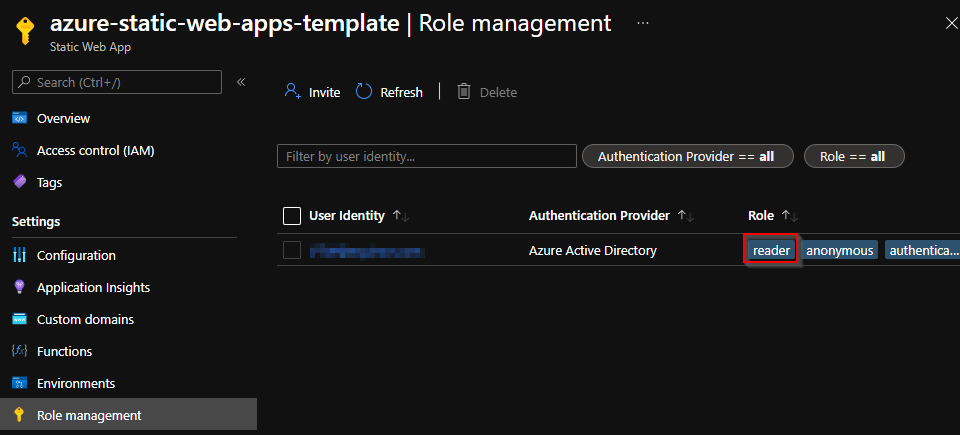

# Azure static web apps template
This repository contains an example of how you can use Azure Static Web Apps to host public and private documentation for you projects. It contains examples of how to host Sphinx/MkDocs documentation and limit the access to certain roles. This repository should work with any type of documentation generator that can compile to HTML files and is not limited to the examples you find in the repo.

<!-- Note: Commented out, since the link is not working
Check out the live demo here](https://brave-tree-035ee0c03.azurestaticapps.net/)
-->

## How to use
This guide uses poetry to manage dependencies and virtual environments, but any package manager should work with some configuration. Please note that you will need the following to complete this setup:
1. A GitHub-account
2. An Azure account and subscription
3. An Azure Resource Group
4. (Optional) The [Azure Az PowerShell module](https://docs.microsoft.com/en-us/powershell/azure/install-az-ps?view=azps-7.2.0)
5. (Optional) The [Bicep extension for VS Code](https://docs.microsoft.com/en-us/azure/azure-resource-manager/bicep/install)

### 1. Prepare the repo

1. Fork this repository or click the template button above

### 2. Set up the Azure Static Web App
There are multiple ways of setting up a Static Web App. In this setup we will use a bicep-script that requires that you have installed the [Azure Az PowerShell module](https://docs.microsoft.com/en-us/powershell/azure/install-az-ps?view=azps-7.2.0) and the [Bicep extension for VS Code](https://docs.microsoft.com/en-us/azure/azure-resource-manager/bicep/install).

Alternativly, you can setup the [Azure Static Web App in Azure](https://docs.microsoft.com/en-us/azure/static-web-apps/get-started-portal?tabs=vanilla-javascript) graphical interface in the Azure Portal and connect it to your forked repository. NB! If you follow this approach, make sure to manually delete the `.github/` folder containing the old Github Actions setup

1. Open PowerShell and navigate to the root folder of the project
2. Log in to Azure with the command `Connect-AzAccount`
3. Start the setup wizard by running `.\azure-web-app-deployer\deployment_wizard.ps1`. Most values can be left as their default values, but you need to supply the Github Repo URL and Token.
4. Go to the Portal > Static Web App Resource > Overview > Manage Deployment Token and copy the token.
5. Go to you Github repo > Settings > Secrets > Actions and click the button "New repository secret". Name the new secret `DEPLOY_TOKEN` and paste in the token.

### 3. Edit the web pages


 1. Clone the repository to your local machine
 2. [Install poetry](https://python-poetry.org/docs/) and then run `poetry install` in the project folder OR use any package manager of your choice and ensure that you have `sphinx` and/or `mkdocs` installed.
    **NB!** If you experience trouble installing poetry (especially if you're an Equinor employee on a Windows), try the following:
    1. Don't install Python using the Windows Store. Instead, download and install [Python 3.8](https://www.python.org/downloads/release/python-380/) (others have ewxperienced issues with the MS Store verison, see [here](https://github.com/python-poetry/poetry/issues/1895) and [here](https://github.com/python-poetry/poetry/issues/1587))
    2. As an Equinor employee, following the [documentation](https://python-poetry.org/docs/) might result in a socket-error: "socket.gaierror: [Errno 11001] getaddrinfo failed". This is probably a proxy-issue that occurs when you are on the work-network. Try repeating the installation step from a different network (e.g. hotspoting from your phone), or modify the relevant proxies.
    3. Despite the Poetry documentation explicitly stating that it add the relevant PATH environment variables for you, this does not happen in all cases. If this becomes an issue, try manually adding `%USERPROFILE%\.poetry\bin`. When this is done, verify that it works by running `poetry --version` in your terminal
    4. By default, Poetry creates a virtual environment in `{cache-dir}\virtualenvs` (Windows). If you instead want it to be placed in the same folder as your project, enter the following command in you terminal `poetry config virtualenvs.in-project true`. If you now run `poetry install`, the relevant files should now be placed in your current working directory-

 3. Depending on which documentation compiler you are using, choose either 1, 2 or both. Make a change in the docs and see that is included in your build
    - Sphinx:
        1. Recompile the documentation by running `poetry run sphinx-build -b html docs/source/sphinx-example docs/build/sphinx-example`
        2. Open the `index.html`-file inside the `build/sphinx-example`-folder.
    - MkDocs:
        1. Watch changes by running `poetry run mkdocs build --config-file docs/mkdocs.yml`
        2. You can serve the page locally as follows: `poetry run mkdocs serve -f docs/source/equinor-example/mkdocs.yml`
 4. Commit the recompiled docs
 5. Visit your web app to view the changes!
 
## Automate compilation of docs
Azure Static Web Apps does not support building non-Javascript projects and therefore you have to compile the docs before it gets deployed. Thankfully, [Github Actions](https://github.com/features/actions) allows us to compile the HTML files before we deploy them to the web app. Doing it this way allows us to delete the build files, so that we do not have to have them committed into our repository. Furthermore, it ensures that we do not have to run any manual steps to update the documentation. Neat! This also means that we can use almost any type of documentation compiler as long as it is possible to install on the Github Action build server and it can compile to HTML. Nice! For this repository, `sphinx` and `mkdocs` is used, but it can modified to work with your preferred build tool.

To build the docs using `sphinx` and `mkdocs`, we need to add some custom build steps to our workflow app. This should be added just below the first step `actions/checkout@v2`:

```yaml
    steps:
      - uses: actions/checkout@v2
        with:
          submodules: true
      
      # Add custom build steps here 

      - name: Set up Python 3.8
        uses: actions/setup-python@v2
        with:
          python-version: 3.8

      - name: Run image
        uses: abatilo/actions-poetry@v2.0.0
        with:
          poetry-version: 1.1.13

      - name: Install Poetry
        run: poetry install
          
      - name: Build docs with Sphinx
        run: poetry run sphinx-build -b html docs/source/sphinx-example docs/build/sphinx-example

      - name: Build docs with MkDocs
        run: poetry run mkdocs build --config-file docs/mkdocs.yml
```

<!-- NOTE: Removed since the link doesn't work
Have a look at the [workflow file](https://github.com/equinor/az-static-web-app-docs-template/blob/main/.github/workflows/azure-static-web-apps-brave-tree-035ee0c03.yml) to see where the steps should be placed.
-->

## Routes and security
Authentication with Azure Static Web Apps is [configured](https://docs.microsoft.com/en-us/azure/static-web-apps/configuration) in a `staticwebapp.config.json`-file. The recommended location for the `staticwebapp.config.json` is in the folder set as the app_location in the workflow file. However, the file may be placed in any subfolder within the folder set as the app_location.
**Note!** `routes.json`, which was previously used to configure routing, is deprecated.

By default, Static Web Apps allow authentication through Azure AD, github, Twitter, Facebook and Google. To restrict our page to only allow authentication through Azure AD, the other options has to manually be disabled.

By default, every user belongs to the built-in anonymous role, and all logged-in users are members of the authenticated role. Optionally, users are associated to custom roles via [invitations](https://docs.microsoft.com/en-us/azure/static-web-apps/authentication-authorization). Example of such roles are "reader" and"contributer".

### Role-based access control
The example below gives all users access to the top level landing page and the `Documentation examples` page and subpages that we created using `Sphinx` and `MkDocs`.

<p align="center" style="border:2px; border-style:solid; padding:1em">
  
</p>

If we want to restrict access to some of our content, we can either require that the users logs in via an Azure AD portal, or that they have specific privaliges to view the page. This is demonstrated with the two bottom buttons; `Verify "authenticated" role` and `Verify "reader"/"contributor" role`. If a user is not logged in, they will be met with the following page:

<p align="center" style="border:2px; border-style:solid; padding:1em">
  
</p>

If the user instead clicks the `Login`-button, they will be offered to login in via an Azure AD portal, and then redirected back to our page. The user now has access to the content we place behind the `Verify "authenticated" role`-button, which in this demonstrations looks like this:

<p align="center" style="border:2px; border-style:solid; padding:1em">
  
</p>

If a user is not already given the role "reader" or "contributor", they will still not have access to the content behind the `Verify "reader"/"contributor" role`-button, and will be met with the following page:

<p align="center" style="border:2px; border-style:solid; padding:1em">
  
</p>

 To grant access to this content, invite the user to the desired role in "Role Management" in the Azure Static Web App settings

<p align="center" style="border:2px; border-style:solid; padding:1em">
  
</p>

 After having received the role as either a "reader" or "contributor", they user will now have access all content placed behind the `Verify "reader"/"contributor" role`-button, which in our example looks like this:

<p align="center" style="border:2px; border-style:solid; padding:1em">
  
</p>

```json
{
    "routes": [
        {
            "route": "/.auth/login/github",         // Disable Github login
            "statusCode": "401"
        },
        {
            "route": "/.auth/login/twitter",        // Disable Twitter login
            "statusCode": "401"
        },
        {
            "route": "/.auth/login/facebook",       // Disable Facebook login
            "statusCode": "401"
        },
        {
            "route": "/.auth/login/google",         // Disable Google login
            "statusCode": "401"
        },
        {
            "route": "/login",                      // Redirect /login to Azure AD login 
            "redirect": "/.auth/login/aad"
        },
        {
            "route": "/logout",                     // Redirect /logout to logout url
            "redirect": "/.auth/logout",
        },
        {
            "route": "/",                           // Allow anonymous access to the top level url
            "allowedRoles": ["anonymous"]
        },
        {
            "route": "/authenticated",              // Limit /authenticated access to only users that have been authenticated (logged in with Azure AD)
            "allowedRoles": ["authenticated"]
        },
        {
            "route": "/reader_role",                // Limit /reader_role access to only users that have been assigned the role "reader" or "contributer
            "allowedRoles": ["reader", "contributer"]
        }
    ]
}
```

### Strict access control
To restrict access to all pages, replace the contents of `routes.json` to the following:

```json
{
    "routes": [
        {
            "route": "/.auth/login/github",         // Disable Github login
            "statusCode": "401"
        },
        {
            "route": "/.auth/login/twitter",        // Disable Twitter login
            "statusCode": "401"
        },
        {
            "route": "/.auth/login/facebook",       // Disable Facebook login
            "statusCode": "401"
        },
        {
            "route": "/.auth/login/google",         // Disable Google login
            "statusCode": "401"
        },
        {
            "route": "/login",                      // Redirect /login to Azure AD login (still needed to login)
            "redirect": "/.auth/login/aad"
        },
        {
            "route": "/logout",                     // Redirect /logout to logout url
            "redirect": "/.auth/logout",
        },
        {
            "route": "/*",                          // All pages require a role of either "reader" or "contributor"
            "allowedRoles": ["reader", "contributer"]
        }
    ]
}
```

## File content explanation
Here is an description of the main files and folders in this project
```
Project
└───.github
|   └───workflows
|           deploy-site.yml                 - Github Actions workflow for building documentation and deploying the service to Azure
|
└───docs
|   └───source                              - Contains source files for documentation.
│   |   └───equinor-example                 - Source folder for the Sphinx example documentation code.
|   |   └───sphinx-example                  - Source folder for the MkDocs example documentation code.
|   |
|   └───build                               - Custom and compiled HTML files than can be manually configured and will be hosted through the Azure Static Web Apps.
|       |   index.html                      - Landing page
|       |   doc_index.html                  - Page for choosing which documentation example you would like to see
|       |   authenticated.html              - Demonstrating the "authenticated" role
|       |   reader_role.html                - Demonstrating the "reader" role
|       |   staticwebapp.config.json        - Azure Static Web Apps routes/authentication configuration (see: https://docs.microsoft.com/en-us/azure/static-web-apps/configuration)
|       |
|       └───sphinx-example                  - Build folder for the Sphinx example documentation code.
|       └───equinor-example                 - Build folder for the MkDocs example documentation code.
|
└───img                                     - Images used in this readme-file
|
|   pyproject.toml                          - (Optional) Project config used by the [Poetry package manager](https://python-poetry.org/).
|   poetry.lock                             - (Optional) Package description used by the package manager.
```

## Deploy to Azure

This repo contains code for deploying the static web app to Azure using Pulumi:

1. Install Pulumi
2. Create a access token in Github with the accesses `repo, workflow, write:packages`
3. Set the access token with `pulumi config set --secret github-access-token GITHUB_TOKEN
4. Navigate to `deploy` folder, run `poetry install` and then `poetry run pulumi up` to deploy
5. The website should now be hosted and available online!