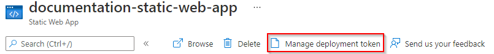
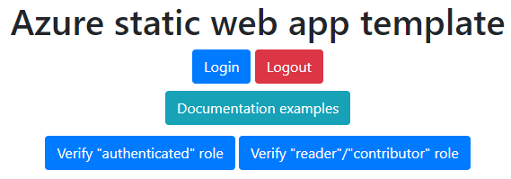
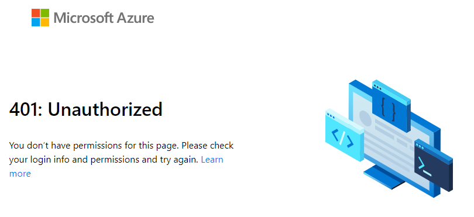
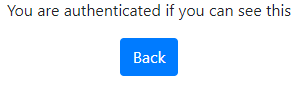
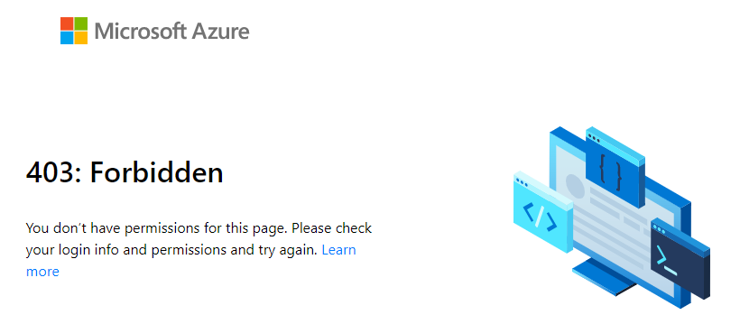
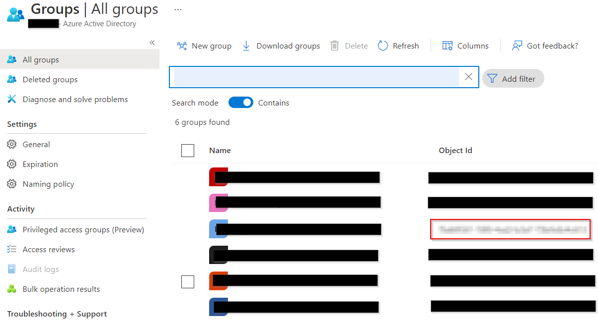
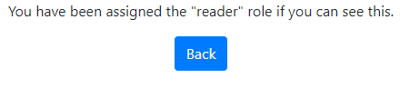
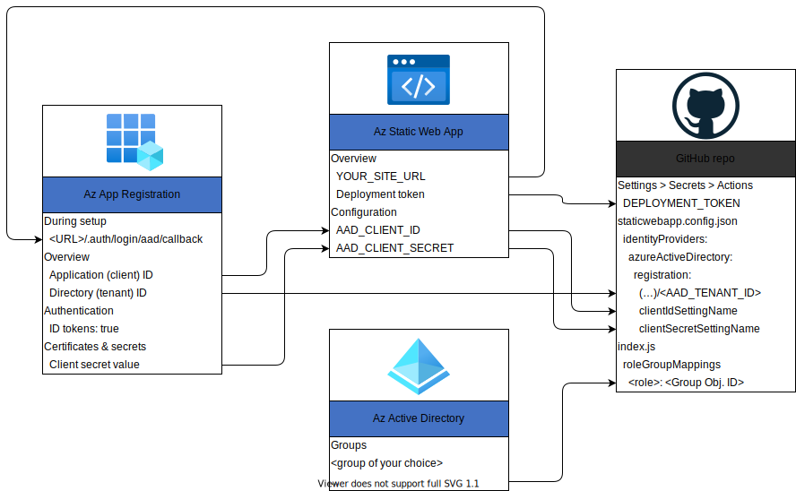

# Host documentation with granular access control using Azure Static Web App
This template repository is designed as a starting point for those who want to host their documentation in a way that provides:

1. Fast, simple and downright gorgeous static web sites using documentation builders like MkDocs, Sphinx, or the static site generator of your choice.
2. CI/CD pipeline that automatically builds and re-deploys your documentation whenever you commit changes to it.
3. Lets you to keep the documentation "physically" close to your code, since you can have both the code and documentation in the same repo.
4. Makes the documentation easily accessible through a (customizable) URL defined in Azure.
5. Authentication using Azure Active Directory, allowing e.g. only members of your organization to access the documentation.
6. Granular access control, where you can limit access for parts of the site to members granted specific roles.

**Check out the live demo [here](https://ambitious-rock-029e94603.1.azurestaticapps.net)**.

This tutorial is split into several sections, adding on more and more of the features mentioned above. If you or your organization do not require all these features, feel free to follow along for as long as it makes sense for you. **PS:** Several chapter ends with an **output**-sections, which lists all the keys, secrets, values etc. that you should have written down before proceeding to the next step.

## Abbreviation 
| Abbreviation | Description            |
|--------------|----------------------- |
| AAD          | Azure Active Directory |
| SWA          | Static Web App         |

## Step 1: Prerequisites
This guide uses poetry to manage dependencies and virtual environments, but any package manager should work with some configuration. Please note that you will need the following to complete this setup:
1. A GitHub-account
2. An Azure account and subscription

## Step 2: Set up the Azure Static Web App
> ***Goal:** After this section, you will be hosting a demo landing page for our documentation web page.*

1. Fork this repository or click the template button above.
2. In [Azure Portal](http://www.portal.azure.com), navigate to [Azure Static Web App in Azure](https://docs.microsoft.com/en-us/azure/static-web-apps/get-started-portal?tabs=vanilla-javascript) and create a new resource. Go through the setup wizard and connect it to your forked repository, as follows:
    1. Select a resource group. If you haven't already created a Resource Group, see the point below.
    2. (Optional) To create a new resource group, click the "Create new"-button underneath the drop-down for selecting resource groups. Alternatively, from the [Azure Portal](http://www.portal.azure.com), go to "Resource Group" and click "Create". Go through the setup wizard to create you resource group.
    3. Give your SWA Resource a descriptive name.
    4. Hosting plan: If you want to enable custom authentication and follow along for the last steps in this tutorial, you must choose the **Standard** plan type.
    5. Select a desired region for hosting your resource. If you are part of an organization, they might have a policy for which you should chose.
    6. Press the button "Sign in with GitHub" and follow the instructions in the pop-up window.


3. Connect to GitHub (image below):
    1. After completing the GitHub login, use the "organization", "repository" and "branch" drop-down menus to select the repository you forked. In this tutorial, we connect the wep app to the `main`-branch. If you want to keep a separate branch for built documentation, feel free to do so.
    2. Select "Custom" in the "Build Presets"-dropdown and fill in the following fields:
        - App location: `/`
        - Api location: `/api`
        - Output location: `/docs/build`

<p align="center" style="border:2px; border-style:solid; padding:1em">
  
</p>

4. Finish the setup wizard by clicking the "Review + create"-button and then the "Create"-button.
5. Once completed, go to your newly created resource. Your SWA has a **deployment token** which (see image below). Please write this down.
6. You SWA also has an **URL** which we will refer to as `YOUR_SITE_URL`. Please write this down as well.

<p align="center" style="border:2px; border-style:solid; padding:1em">
  
</p>

### <a name="under-the-hood"></a>Under-the-hood: What just happened?

1. First, Azure automatically registers the **deployment token** as a secret in your repository, which you can view by visiting your **GitHub Repo > Settings > Secrets > Actions**. This gives the Web App access to your repo.
2. Second, Azure commits a workflow-file to your repo which contains the necessary GitHub Action for deploying the website located in `/docs/build`. This is triggered automatically when anything is pushed to main, and will handle the connection and deployment of content to your SWA.
    - You can view triggered actions by clicking on "Actions" in your GitHub repo. (**NB!** The `deploy-site.yml`-action will fail at this point since we haven't yet created the GitHub secret that it expects. This will be fixed later).
    - You can view the newly created GitHub Action file in the folder `.\.github\workflows`.
3. After the GitHub Action has completed, you can visit the **URL** found to your SWA. If deployed successfully, you should be welcomed by the following demo page:

<p align="center" style="border:2px; border-style:solid; padding:1em">
  
</p>

Feel free to click the "documentation examples" button and browse the two examples. The other buttons will not work properly yet.

**Note:** The text printout at the bottom of the page is only for debugging purposes, which will be useful in the sections related to authentication and role management..

### Output
- `deployment token`
- `YOUR_SITE_URL`

## Step 3: Automate the compilation of docs
> ***Goal:** After this section, the documentation examples will be built and deployed, making them visible on your SWA. Further, a Github Action workflow will ensure that the documentation automatically re-builds and re-deploys itself when new changes are committed to the branch.*

SWAs does not support building non-Javascript projects and therefore you have to compile the docs before it gets deployed. Thankfully, [Github Actions](https://github.com/features/actions) allows us to build and compile the HTML files as part of the action that deploys them to the web app. Doing it this way allows us to delete the build files, so that they don't clutter our repository. Neat! Furthermore, it ensures that we do not have to run any manual steps to update the documentation. Double-neat! This also means that we can use almost any type of documentation compiler as long as it is possible to install on the Github Action build server and it can compile to HTML. Triple-neat! For this repository, `sphinx` and `mkdocs` is used, but it can modified to work with your preferred build tool.

To build the docs using `sphinx` and `mkdocs`, we need to add some custom build steps to the workflow file that the SWA created during its setup. Rather than editing the newly created workflow file, we can use the file that comes with this repo.

**NB!** In the next steps we will delete the github action that was created by our SWA, and replace it with the `deploy-site.yml` that already exist in the template repo. However, this will break the link in your SWA's overview page which give a link to the github action it created. Currently, there is no way of updating this link. It will not affect operation, but if you would like to keep this link intact, you should copy the content from `deploy-site.yml` into the newly created yml-file, and delete the `deploy-site.yml`-fil instead.

1. Navigate to your GitHub Repo > Settings > Secrets > Actions > Repository secrets.
2. There should only be one secret called `AZURE_STATIC_WEB_APPS_API_TOKEN_<URL-name>` under "Actions secrets". Delete this secret by pressing "Remove".
3. Create a new repository secret by clicking "New repository secret" and use the following values:
    - Name: `"DEPLOYMENT_TOKEN"`
    - Value: `deployment token` (output from previous chapter)
4. Locate your workflow files in `.\.github\workflow`. There should be three files there, where you should delete the first one:
    1. `azure-static-web-apps-<YOUR_SITE_URL>.yml`: *Delete this and commit changes. This file was created when you created the SWA*
    2. `deploy-site.yml`: *This will replace the file above*
    3. `lint-and-format.yml`: *This file is optional, feel free to delete it. It runs some linting and syntax checks on your code*

### Under-the-hood: What just happened?
The Github workflow committed by the Static Web app only contains the actions necessary for deploying the already built files that the template repo provided. The `deploy-site.yml` file contains additional steps that enable automatic building of the documentation using both MkDocs and Sphinx (in production, you would probably only use one).

```yaml
- name: Set up Python 3.8
  uses: actions/setup-python@v2
  with:
    python-version: 3.8

- name: Build install poetry
  run: |
    curl -sSL https://raw.githubusercontent.com/python-poetry/poetry/master/get-poetry.py | python -
    echo "$HOME/.poetry/bin" >> $GITHUB_PATH

- name: Install Poetry
  run: poetry install
        
- name: Build docs with Sphinx
  run: poetry run sphinx-build -b html docs/source/sphinx-example docs/build/sphinx-example

- name: Build docs with MkDocs
  run: poetry run mkdocs build --config-file docs/mkdocs.yml
```

Rather than modifying the workflow-file created by the SWA, we just renamed the github secret token to `DEPLOYMENT_TOKEN` (which is what the `deploy-site.yml`-file expects) and deleted the file created by the SWA. By modifying the secret *before* deleting the file, we ensured that the workflow was not triggered by a new commit before the renaming of the secret was handled.

### (Optional): Editing the documentation
**Sphinx:**<br>
Sphinx expects `.rts`-files as default, but can be extended to support a range of different file formats (like e.g. markdown). Locate the example in the `.\docs\sources\sphinx-example`-folder. To add a new pages, create the file and add it to the `index.rst`-file. Then re-build the documentation page by either pushing a new commit or by building it manually (see the next chapter).

**MkDocs**<br>
MkDocs only supports markdown-files. An example is located in the `.\docs\sources\equinor-example`-folder. To add a new pages, create the file and add it to the `mkdocs.yml`-file. Then re-build the documentation page by either pushing a new commit or by building it manually (see the next chapter).<br>

**NB!** The `mkdocs.yml` file would normally be placed at the top folder for the documentation files, but is currently placed on level above in this demo to make it easier to work with two documentation frameworks.

**Note:** In the `mkdocs.yml`-file, please update the keys `site_url`, `repo_name` and `repo_url` to match your own project. The builder inserts these links into your page (in the logo and the edit-button)

### (Optional): Building the documentation manually
1. [Install poetry](https://python-poetry.org/docs/) and then run `poetry install` in the project folder OR use any package manager of your choice and ensure that you have `sphinx` and/or `mkdocs` installed.<br>
**NB!** If you experience trouble installing poetry (especially if you're an Equinor employee on a Windows), try the following:

    1. Don't install Python using the Windows Store. Instead, download and install [Python 3.8](https://www.python.org/downloads/release/python-380/) (others have experienced issues with the MS Store version, see [here](https://github.com/python-poetry/poetry/issues/1895) and [here](https://github.com/python-poetry/poetry/issues/1587)).

    2. As an Equinor employee, following the [documentation](https://python-poetry.org/docs/) might result in a socket-error: "socket.gaierror: [Errno 11001] getaddrinfo failed". This is probably a proxy-issue that occurs when you are on the work-network. Try repeating the installation step from a different network (e.g. hotspotting from your phone), or modify the relevant proxies.

    3. Despite the Poetry documentation explicitly stating that it add the relevant PATH environment variables for you, this does not happen in all cases. If this becomes an issue, try manually adding `%USERPROFILE%\.poetry\bin`. When this is done, verify that it works by running `poetry --version` in your terminal.

    4. By default, Poetry creates a virtual environment in `{cache-dir}\virtualenvs` (Windows). If you instead want it to be placed in the same folder as your project, enter the following command in you terminal `poetry config virtualenvs.in-project true`. If you now run `poetry install`, the relevant files should now be placed in your current working directory.

2. Depending on which documentation compiler you are using, choose either the first, the second or both options below. Make a change in the docs and see that is included in your build:
    - Sphinx:
        1. Recompile the documentation by running `poetry run sphinx-build -b html docs/source/sphinx-example docs/build/sphinx-example`.
        2. Open the `index.html`-file inside the `build/sphinx-example`-folder.
    - MkDocs:
        1. Recompile the documentation by running `poetry run mkdocs build --config-file docs/mkdocs.yml`.
        2. You can serve the page locally as follows: `poetry run mkdocs serve -f docs/source/equinor-example/mkdocs.yml`.
 
## Step 4: Set up authentication using Azure Active Directory
> ***Goal:** After this section, the user should be able to click the "login" button on the SWA and then have access to the content behind the "Verify authenticated role" button. This can be useful if you want to restrict content to employees of your company only.*

For the next two steps, we will follow along with Microsoft's own [tutorial](https://docs.microsoft.com/en-us/azure/static-web-apps/assign-roles-microsoft-graph).

By default, every user belongs to the built-in *anonymous* role, and all logged-in users are members of the *authenticated* role.

Also by default, SWAs allow authentication through Azure AD, github, Twitter, Facebook and Google. In this example, we only want employees of our organization to be able to authenticate, and other options has therefor manually been disabled in the `staticwebapp.config.json`-file.

### Create an Azure Active Directory application

The current chapter is based on [this section](https://docs.microsoft.com/en-us/azure/static-web-apps/assign-roles-microsoft-graph#create-an-azure-active-directory-application) in Microsoft's own documentation.

#### App registration
1. In the Azure portal, search for and navigate to *Azure Active Directory*.
2. In the menu bar, select **App registrations**.
3. Select **+ New registration** to open the *Register an application page*.
    - NB! Your organization might require you to activate a role in **Azure Privileged Identity Management** with elevated privileges to do this.
4. Enter a name for the application. For example, **MyStaticWebApp**.
5. For *Supported account types*, select **Accounts in this organizational directory only**.
6. For *Redirect URIs*, select **Web** and enter the **AAD** login [authentication callback](https://docs.microsoft.com/en-us/azure/static-web-apps/authentication-custom?tabs=aad#authentication-callbacks) of your static web app. For example, `<YOUR_SITE_URL>/.auth/login/aad/callback`.

Replace `<YOUR_SITE_URL>` with the URL of your static web app from a previous section.

<p align="center" style="border:2px; border-style:solid; padding:1em">
  
</p>

7. Select **Register**.
8. After the app registration is created, write down the **Application (client) ID** and **Directory (tenant) ID** in the *Essentials* section. You'll need these values to configure AAD authentication in your static web app.

We will now create a client secret:
1. Select *Authentication* in the menu bar.
2. In the *Implicit grant and hybrid flows* section, select **ID tokens (used for implicit and hybrid flows)**.

<p align="center" style="border:2px; border-style:solid; padding:1em">
  
</p>

This configuration is required by Static Web Apps to authenticate your users.

3. Select **Save**.
4. Select *Certificates & secrets* in the menu bar.
5. In the *Client secrets section*, select **+ New client secret**.
6. Enter a name for the client secret. For example, **MyStaticWebApp**.
7. Choose a duration for the Expires field (default is 6 months).

**Note:** *You must rotate the secret before the expiration date by generating a new secret and updating your app with its value.*

8. Select **Add**.
9. Write down the **Value** of the client secret you created, which we will refer to as your **client secret value**. You'll need this value to configure AAD authentication in your static web app.

<p align="center" style="border:2px; border-style:solid; padding:1em">
  
</p>

#### Output
- `Application (client) ID`
- `Directory (tenant) ID`
- `Client secret value`

### Configure Active Directory authentication
The current chapter is based on [this section](https://docs.microsoft.com/en-us/azure/static-web-apps/assign-roles-microsoft-graph#configure-active-directory-authentication) in Microsoft's own documentation.

1. In a browser, open the GitHub repository containing the static web app you deployed. Navigate to the app's configuration file at *staticwebapp.config.json*. It contains the following section:

``` json
"auth": {
  "rolesSource": "/api/GetRoles",
  "identityProviders": {
    "azureActiveDirectory": {
      "userDetailsClaim": "http://schemas.xmlsoap.org/ws/2005/05/identity/claims/name",
      "registration": {
        "openIdIssuer": "https://login.microsoftonline.com/<YOUR_AAD_TENANT_ID>",
        "clientIdSettingName": "AAD_CLIENT_ID",
        "clientSecretSettingName": "AAD_CLIENT_SECRET"
      },
      "login": {
        "loginParameters": [
          "resource=https://graph.microsoft.com"
        ]
      }
    }
  }
},
```

**Note:** To obtain an access token for Microsoft Graph, the `loginParameters` field must be configured with `resource=https://graph.microsoft.com`.

2. Select the **Edit** button to update the file.
3. Update the *openIdIssuer* value of `https://login.microsoftonline.com/<YOUR_AAD_TENANT_ID>` by replacing `<YOUR_AAD_TENANT_ID>` with the **directory (tenant) ID** of your AAD that you wrote down earlier.
4. Select **Commit directly to the main branch** and select **Commit changes**.
5. A GitHub Actions run triggers to update the static web app.
6. Navigate to your SWA resource in the Azure portal.
7. Select **Configuration** in the menu bar.
8. In the *Application settings* section, add the following settings:

| Name                | Value                                       |
| ------------------- | ------------------------------------------- |
| `AAD_CLIENT_ID`     | Your AD **application (client) ID**         |
| `AAD_CLIENT_SECRET` | Your AD application **client secret value** |

9. Select **Save**.

If you visit our landing page and click the **Verify "authenticated" role** button, you will be met with an "401: Unauthorized" page.

<p align="center" style="border:2px; border-style:solid; padding:1em">
  
</p>

If you instead clicks the `Login`-button, you will be offered to login in via an AAD portal, and then redirected back to your page. You should now have access to the content placed behind the **Verify "authenticated" role** button, which should look like this:

<p align="center" style="border:2px; border-style:solid; padding:1em">
  
</p>

**Note:** Your organization might have special rules set up to manage who get's access. If you are not able to complete the login, you can try to first elevate your privileges in Azure's **Privileged Identity Management** and the retry logging in.

#### Output
- `AAD_CLIENT_ID`
- `AAD_CLIENT_SECRET`

## Step 5: Role management
> ***Goal:** This section will show how to obtain even more granular access control by assigning access roles to a subset of your organization.*

The current chapter is based on [this section](https://docs.microsoft.com/en-us/azure/static-web-apps/assign-roles-microsoft-graph#configure-active-directory-authentication) in Microsoft's own documentation.

In the previous chapter, we enforced that users had to log in to access the content behind the **Verify "authenticated" role** button. In this chapter, we will create a custom "reader" role that we can assign to users who should be able access the content behind the **Verify "reader" role** button. If a user is not already given the "reader" role, they will still not have access to the content behind the **Verify "reader" role** button, and will be met with the following page:

<p align="center" style="border:2px; border-style:solid; padding:1em">
  
</p>

To achieve this, the template repo contains a serverless function (*api/GetRoles/index.js*) that queries Microsoft Graph to determine if a user is in a pre-defined group. Based on the user's group memberships, the function assigns custom roles to the user. The application is configured to restrict certain routes based on these custom roles. You can read more about Azure Functions in SWA [here](https://docs.microsoft.com/en-us/azure/static-web-apps/add-api?tabs=vanilla-javascript).

1. In AAD, navigate to "groups" and find a group to which you want to assign the reader role. Write down the **Object Id**.

<p align="center" style="border:2px; border-style:solid; padding:1em">
  
</p>

2. In your GitHub repository, navigate to the *GetRoles* function located at *api/GetRoles/index.js*. Near the top, there is a `roleGroupMappings` object that maps custom user roles to AAD groups.
3. Click the **Edit** button.
4. Update the object with your custom role name (e.g. "reader") and the group ID(s) from your AAD tenant.

``` js
const roleGroupMappings = {
  'reader': '<Object ID>'
};
```

The *GetRoles* function is called whenever a user is successfully authenticated with Azure Active Directory. The function uses the user's access token to query their Active Directory group membership from Microsoft Graph. If the user is a member of any groups defined in the `roleGroupMappings` object, the corresponding custom roles are returned by the function.

**Note:** The current function app only supports the assignment of _one_ AAD Group per role. If you would like to assign the same role to multiple groups, you must re-write the function a little. Feel free to open a PR if you decide to do so ;)

In the above example, if a user is a member of the Active Directory group that you selected in the first step, they are granted the reader role.

5. Select **Commit directly to the main branch** and select **Commit changes**.
6. A GitHub Actions run triggers to update the static web app.
7. When the deployment is complete, you can verify your changes by navigating to the app's URL.
8. Log in to your static web app using AAD.
9. You should now be able to see the content behind the **Verify "reader" role** button, but not the content behind the **Verify "admin" role** button.

<p align="center" style="border:2px; border-style:solid; padding:1em">
  
</p>

## Step 6: Routing and role authentication
See the [Configure Azure Static Web Apps](https://docs.microsoft.com/en-us/azure/static-web-apps/configuration) for more information about routing and setting the role requirements for the different part of the website. This is all configured in the `staticwebapp.config.json`-file. 

**Note:** `routes.json`, which was previously used to configure routing, is deprecated.

## Architecture


## File content explanation
Here is an description of the main files and folders in this project:

```
Project
└───.github
|   └───workflows
|           deploy-site.yml                 - Github Action workflow for building documentation and deploying the service to Azure
|           lint-and-format.yml             - Github Action workflow for linting and validating syntax
|
└───api
|   |   (...)                               - Several config files for the serverless function powered by Azure Function)
|   └───GetRoles
|       └───function.json                   - Azure Function config
|       └───index.js                        - Serverless Function that assigns custom roles to users
|
└───docs
|   └───source                              - Contains source files for documentation.
│   |   └───equinor-example                 - Source folder for the Sphinx example documentation code.
|   |   └───sphinx-example                  - Source folder for the MkDocs example documentation code.
|   |
|   └───build                               - Custom and compiled HTML files than can be manually configured and will be hosted through the Azure Static Web Apps.
|       |   index.html                      - Landing page
|       |   doc_index.html                  - Page for choosing which documentation example you would like to see
|       |   authenticated.html              - Demonstrating the "authenticated" role
|       |   reader_role.html                - Demonstrating the "reader" role
|       |   staticwebapp.config.json        - Azure Static Web Apps routes/authentication configuration (see: https://docs.microsoft.com/en-us/azure/static-web-apps/configuration)
|       |
|       └───sphinx-example                  - Build folder for the Sphinx example documentation code.
|       └───equinor-example                 - Build folder for the MkDocs example documentation code.
|
└───img                                     - Images used in this readme-file
|
|   pyproject.toml                          - (Optional) Project config used by the [Poetry package manager](https://python-poetry.org/).
|   poetry.lock                             - (Optional) Package description used by the package manager.
```
